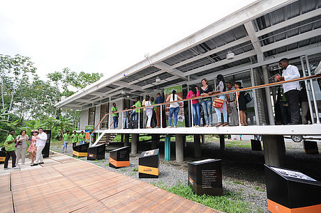

```{r setup, include=FALSE}
library(tufte)
# invalidate cache when the tufte version changes
knitr::opts_chunk$set(tidy = FALSE, cache.extra = packageVersion('tufte'))
options(htmltools.dir.version = FALSE)
```
```{r fig-margin9, fig.margin=TRUE, echo=FALSE, fig.cap="Sede Tumaco - Universidad Nacional de Colombia. Foto: Agencia de Noticias UN."}

```

# Introducción

Este documento pretende presentar una somera introducción al análisis de desvinculación académica del programa PEAMA - Sede Tumaco. 

Primero se introducirán unos términos comunes en el análisis estadístico y en el contexto del problema. A continuación se mostrarán unas cifras iniciales del seguimiento temporal de desvinculación académica para la sede Tumaco y, finalmente, se propondrá una metodología de tratamiento y análisis.

Los datos utilizados fueron suministrados por la Vicerectoría Académica y por el Sistema de Información Académica. Las definiciones fueron tomadas de @UNAL45 

**_Nota_**: La sede Tumaco recibió la primera cohorte de estudiantes bajo la modalidad del Programa Especial de Admisión y Movilidad Académica a partir del primer semestre de 2015. En este sentido y por disponibilidad de la información, únicamente se analizan seis periodos académicos: 2015-I, 2015-II, 2016-I, 2016-II, 2017-I y 2017-II. Naturalmente no se analiza evento de graduación por cuanto ningún estudiante finalizó su plan de estudios en los seis periodos analizados.

# Glosario

1. *Aspirante:* es la persona que reúne las condiciones establecidas en el Acuerdo 008 de 2008 del Consejo Superior Universitario y en particular en la Resolución 55 de 2016 de Rectoría, "Por la cual se reglamenta para el Programa Especial de Admisión y Movilidad Académica (PEAMA) de Presencia Nacional, la admisión, la matrícula inicial para admitidos, la región de influencia para las Sedes Amazonia, Caribe, Orinoquia y Tumaco y los estímulos económicos para el personal académico de la Universidad Nacional de Colombia y se deroga la Resolución 887 de 2015 de la Rectoría".

2. *Admitidos:* es la persona que ha superado el proceso de admisión a la Universidad según el Acuerdo 008 de 2008 del Consejo Superior Universitario.

3. *Matriculado:* es el admitido que adquiere la calidad de estudiante siempre y cuando supere el proceso de registro y matrícula inicial, estipulados en el Acuerdo 008 de 2008 del Consejo Superior Universitario.

4. *Episodio:* Corresponde al evento de desvinculación o de reintegro que presenta el estudiante en su trayectoria. Se identifica por la ausencia de matrícula en un semestre, dado que en el anterior el estudiante estaba matriculado (evento de desvinculación); y por la presencia de matrícula en un semestre, dado que en el anterior no la había (evento de reintegro). 

5. *Evento de desvinculación:* Equivale a la ausencia de matrícula en el programa curricular por lo menos en un semestre, habiéndose matriculado anteriormente. Puede llegar a ser temporal (desvinculación temporal) o definitiva (desvinculación definitiva o deserción).

6. *Evento de desvinculación según el momento de ocurrencia*, puede ser: 
  + *Temprana:* Evento de desvinculación posterior a la admisión pero anterior a la matrícula, es decir, estudiantes que habiendo sido admitidos, no se matriculan.
  + *Al inicio:* Evento de desvinculación durante los primeros tres semestres. 
  + *En el intermedio:* Evento de desvinculación durante el intervalo de 4 a 7 semestres. 
  + *Al final:* Evento de interrupción desde el 8º semestre. 

7. *Evento de desvinculación según la duración*, puede ser:
  + *Temporal:* Evento de desvinculación durante cuatro o menos semestres consecutivos.
  + *Deserción:* Evento de desvinculación durante cinco semestres consecutivos o más, siempre y cuando no haya cursado la totalidad de semestres que prescribe el plan de estudios.

8. *Evento de desvinculación según el modo*, puede ser:
  + *Desvinculación académica:* Evento de desvinculación forzado al presentar un Promedio Aritmético Ponderado Acumulado (PAPA) inferior a 3.0; no disponer de un cupo de créditos suficiente para inscribir las asignaturas del plan estudios pendientes de aprobación; no cumplir con los requisitos para la renovación de la matrícula en los plazos señalados por la Universidad; recibir sanción disciplinaria; culminar el plan de estudios (situación que para los estudiantes vinculados a PEAMA-Tumaco aún no se da por la cantidad de semestres cursados hasta la fecha).
  + *Desvinculación no académica:* Evento de desvinculación que no cumple los criterios de desvinculación académica.
  
9. *Evento de reintegro:* Equivale a la matrícula en un semestre del programa curricular dado que antes se había presentado por lo menos un evento de desvinculación.

# Descripción inicial

```{r fig-margen, fig.margin = TRUE, fig.cap = "Cantidad de aspirantes PEAMA - Tumaco por periodo", fig.width=3.5, fig.height=3.5, cache=TRUE, message=FALSE, echo=FALSE}
library(ggplot2)
library(dplyr)
df <- data_frame(semestre=c('2015-I', '2015-II', '2016-I', '2016-II', '2017-I', '2017-II'), aspirantes = c(493, 662, 1270, 668, 1108, 966))
ggplot(data=df, aes(x=semestre, y=aspirantes)) +
  geom_bar(stat="identity", fill="steelblue")+
  geom_text(aes(label=aspirantes), vjust=1.6, color="white", size=3.5)
```

## Periodos

Los periodos estudiados comprenden desde el 2015-I al 2017-II, de acuerdo con la disposición de información consolidada en las distintas dependencias de la Universidad.

```{r fig-margen2, fig.margin = TRUE, fig.cap = "Cantidad de admitidos PEAMA - Tumaco por periodo", fig.width=3.5, fig.height=3.5, cache=TRUE, message=FALSE, echo=FALSE}
library(ggplot2)
df2 <- data_frame(semestre=c('2015-I', '2015-II', '2016-I', '2016-II', '2017-I', '2017-II'), admitidos = c(51, 54, 54, 90, 158, 73))
ggplot(data=df2, aes(x=semestre, y=admitidos)) +
  geom_bar(stat="identity", fill="steelblue")+
  geom_text(aes(label=admitidos), vjust=1.6, color="white", size=3.5)
```

## Aspirantes

En la figura 2 se detalla la cantidad de aspirantes por periodo. Es de resaltar que al comenzar cada año se presentan más aspirantes al programa que para el segundo semestre del año. Igualmente es notablemente visible que el número de aspirantes se ha ido incrementando paulatinamente.

```{r fig-margen3, fig.margin = TRUE, fig.cap = "Ddmitidos vs. Matriculados PEAMA - Tumaco por periodo", fig.width=3.5, fig.height=3.5, cache=TRUE, message=FALSE, echo=FALSE}
df3 <- data_frame(
  semestre=c('2015-I', '2015-II', '2016-I', '2016-II', '2017-I', '2017-II', '2015-I', '2015-II', '2016-I', '2016-II', '2017-I', '2017-II'), 
  Grupo = rep(c("Admitidos", "MPVZ"), each = 6),
  Valor = c(51, 54, 54, 90, 158, 73, 49, 50, 46, 72, 118, 62))

ggplot(data=df3, aes(x=semestre, y=Valor, fill=Grupo)) +
  geom_bar(stat="identity", position=position_dodge())+
  geom_text(aes(label=Valor), vjust=1.6, color = 'white',
            position = position_dodge(0.9), size=3)+
  scale_fill_brewer(palette="Paired")+
    theme(legend.position="bottom") 

```

## Admitidos 

En la figura 3 se observa la cantidad de admitidos por periodo académico. En este caso, el porcentaje de admisión es, en promedio, cercano al 10% frente a los aspirantes.
```{r fig-margen4, fig.margin = TRUE, fig.cap = "Matriculados vs. Desvinculados al inicio PEAMA - Tumaco por periodo", fig.width=3.5, fig.height=3.5, cache=TRUE, message=FALSE, echo=FALSE, warning=FALSE}
df4 <- data_frame(
  semestre=c('2015-I', '2015-II', '2016-I', '2016-II', '2017-I', '2017-II', '2015-I', '2015-II', '2016-I', '2016-II', '2017-I', '2017-II'), 
  Grupo = rep(c("Matriculados", "Desvinculados al inicio"), each = 6),
  Valor = c(49, 50, 46, 72, 118, 62, 24, 5, 11, 25, 20, NA))

ggplot(df4) +
  geom_bar(aes(x = semestre, y = Valor, fill = Grupo),
           stat = "identity",
           position = position_stack())+
  geom_text(data = df4 %>% filter(semestre == '2015-I'),
            aes(x = semestre, y = Valor, 
                label = Valor) ,
            position = position_stack(vjust = .5)) +
  geom_text(data = df4 %>% filter(semestre == '2015-II'),
            aes(x = semestre, y = Valor, 
                label = Valor) ,
            position = position_stack(vjust = .5)) +
  geom_text(data = df4 %>% filter(semestre == '2016-I'),
            aes(x = semestre, y = Valor, 
                label = Valor) ,
            position = position_stack(vjust = .5)) +
  geom_text(data = df4 %>% filter(semestre == '2016-II'),
            aes(x = semestre, y = Valor, 
                label = Valor) ,
            position = position_stack(vjust = .5)) +
  geom_text(data = df4 %>% filter(semestre == '2017-I'),
            aes(x = semestre, y = Valor, 
                label = Valor) ,
            position = position_stack(vjust = .5)) +
  geom_text(data = df4 %>% filter(semestre == '2017-II'),
            aes(x = semestre, y = Valor, 
                label = Valor) ,
            position = position_stack(vjust = .5)) + 
  scale_fill_brewer(palette="Paired") +
  theme(legend.position="bottom") 

```


## Matrícula primera vez (MPVZ)

Hay un hecho de especial interés que se centra en la cantidad de estudiantes matriculados frente a los que ya son admitidos. En este sentido, cabe preguntarse qué hace que un joven que ya ha superado el proceso de admisión (si se quiere, la etapa más difícil para acceder a la Universidad Nacional de Colombia) no supere el proceso de registro y matrícula inicial. Este fenómeno se ha denominado *Deserción temprana*.

La figura 4 ilustra la relación de la Deserción temprana al mostrar la cantidad de admitidos frente a los matriculados por primera vez para cada periodo académico estudiado.

## Desvinculación al inicio

Para cada uno de los periodos se cuenta con la información de los estudiantes que se desvincularon tras el primer periodo académico cursado. La figura 4 muestra la cantidad de estudiantes matriculados en cada periodo (en azul oscuro) y cuántos de ellos se desvincularon tras haber cursado su primer semestre en la universidad (en azul claro).


Aquí cabe resaltar el hecho de que para 2015-I el porcentaje de deserción es del 49%, en 2015-II es del 10%, en 2016-I del 23.9%, en 2016-II del 34.7%, en 2017-I del 16.9% y que para 2017-II no se cuenta aún con la información.

## Matriculados

A continuación se relacionan los estudiantes matriculados por cohorte a cada periodo académico.

| Periodo | MPVZ | 2015-I | 2015-II | 2016-I | 2016-II | 2017-I | 2017-II |
|:-------:|:----:|:------:|:-------:|:------:|:-------:|:------:|:-------:|
|  2015-I |  49  |   49   |    24   |   31   |    24   |   21   |    20   |
| 2015-II |  50  |        |    50   |   45   |    42   |   40   |    39   |
|  2016-I |  46  |        |         |   49   |    39   |   34   |    33   |
| 2016-II |  72  |        |         |        |    74   |   49   |    47   |
|  2017-I |  118 |        |         |        |         |   121  |    89   |
| 2017-II |  62  |        |         |        |         |        |    68   |

La forma de leer la tabla es la siguiente: para el periodo 2015-I, por ejemplo, 49 estudiantes se matricularon a primer semestre, de esos 49, 24 se matricularon en 2015-II; de los 49 originales, 31 estudiantes se matricularon en 2016-I; de los 49 originales, 24 estudiantes se matricularon en 2016-II y así, sucesivamente. 

Puede observarse, sin embargo, que en muchos casos la cantidad de estudiantes matriculados por primera vez difiere de los matriculados en el periodo académico. Tal es el caso, por ejemplo, del periodo 2016-II, donde se matricularon 72 estudiantes pero en el periodo aparecen matriculados 74. Estas diferencias se explican por diferentes eventos tales como reingreso, traslado, etc. De igual forma, el aumento en la cantidad de estudiantes en el periodo observado en relación con uno anterior se debe a que algunos estudiantes que se habían desvinculado temporalmente, solicitan reingreso.

# Metodología propuesta para el análisis estadístico

Siguiendo las ideas de @UNAL45, es posible aplicar un *análisis de supervivencia en tiempo discreto con múltiples eventos*, propuesto por @willett1995s para analizar los datos de desvinculación y deserción de los estudiantes PEAMA de la sede Tumaco de la Universidad Nacional de Colombia. La ventaja que presenta la metodología propuesta es considerar la naturaleza longitudinal de los datos frente a técnicas transversales utilizadas en estudios similares (@UNAL44).

## Génesis

En el año 2010 el estudio se enfocó en la graduación, deserción y rezago de los estudiantes de las cohortes comprendidas entre el año 2004 y 2007 de los programas de posgrado de las sedes Bogotá, Medellín, Manizales y Palmira. Se analizaron la desvinculación temporal y definitiva por separado. La facultad de Ciencias se ubicaba entre las facultades con mayor índice de deserción, situación que también se estudió y evidenció para programas de pregrado. Se pudo ver que la gran mayoría de estudiantes desertó en su primera interrupción. Los hallazgos revelaron que el género, la edad y el hecho de tener una beca constituyen factores asociados con las probabilidades de grado y deserción. La metodología estadística empleada para el modelamiento en ambos estudios fue la regresión logística (@UNAL44).

## Particularidades del análisis

Se pueden identificar varios fenómenos en la dinámica de ingreso y salida de los estudiantes: los que ingresan al programa y por alguna razón se desvinculan parcialmente o de forma definitiva; aquellos que llegan a graduarse en el tiempo previsto o aquellos que prolongan su permanencia en la universidad más allá de los tiempos establecidos por los planes de estudio. En particular, el interés se puede centrar en analizar el tiempo hasta la ocurrencia de desvinculación en general, es decir, sin discriminar el carácter temporal o definitivo de la desvinculación, teniendo en cuenta la influencia de algunas variables sociodemográficas. La metodología propuesta dentro del análisis es la construcción de un modelo logístico de riesgo discreto con efecto continuo. Se pueden tomar como referencia los datos correspondientes al censo de los estudiantes que ingresaron entre los periodos académicos 2015-I al 2017-II de la Universidad Nacional de Colombia e incluso periodos posteriores, en caso que las dependencias de la Universidad puedan consolidar esa información al momento del análisis estadístico.

El análisis de supervivencia en tiempo discreto con múltiples eventos explora el fenómeno de deserción académica considerando la desvinculación ya sea temporal o definitiva de estudiantes del programa PEAMA de la Sede Tumaco, con lo cual se busca cuantificar la influencia de factores determinantes, en términos del tiempo, que potencian la ocurrencia del evento y a los cuales se debe prestar especial atención con el fin de minimizar la desvinculación académica y controlar el tiempo que toma graduarse. 

En ese sentido, se puede abordar la evaluación del equilibrio entre la capacidad de la Universidad en el sentido de retener estudiantes que ingresan a programas de pregrado y la posibilidad de que ellos terminen de forma satisfactoria el plan de estudios. Esto permitirá que los entes administrativos responsables, tengan bases para afrontar las demás problemáticas planteadas anteriormente, al igual que otros interrogantes que surjan de ese análisis. Se espera, además, que el estudio sea insumo para comprender el comportamiento general de la desvinculación y brinde información no disponible para la Universidad, de la misma forma que ayude a establecer una base para posibles estudios futuros.


